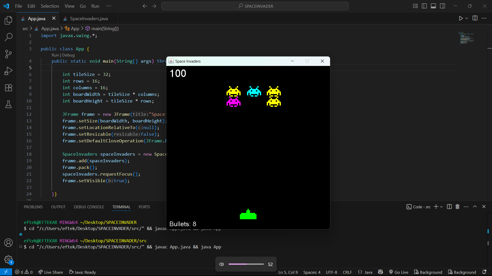

# 🚀 Space Invaders 🚀

A retro-style **Space Invaders** game clone developed in **Java** using **Swing** and **AWT**.  
Control the ship, shoot aliens, and survive with limited bullets.  
Fun and simple mechanics – with automatic wave generation and difficulty increase!
I built this game seeing a youtube video to learn how to build a game using java and swing.I modified many of its feature like limited bullet number added restart button and i will try more feature infuture.
---

## 🎮 Features

- 🚀 Player-controlled spaceship with smooth left/right movement
- 👽 Multiple types of aliens with random colors
- 💥 Collision detection between bullets and aliens
- 📈 Scoring system with wave progression
- 🔫 Limited bullets to increase challenge
- 🔁 Auto-restart after game over or bullet exhaustion
- 🖼️ Clean 2D rendering using `Graphics`

---



## 🧑‍💻 Tech Stack

- **Language**: Java
- **Libraries**: Java Swing, AWT
- **IDE**: VS Code / IntelliJ / Eclipse
- **Graphics**: PNG assets (ship + aliens)

---

## 🛠️ How to Run

### ✅ Prerequisites

- Java JDK 8 or higher installed
- Java-compatible IDE or terminal

### ▶️ Run Instructions

1. Clone the repository:

   ```bash
   git clone https://github.com/eftekar1473/SpaceInvaders.git
   cd SpaceInvaders

